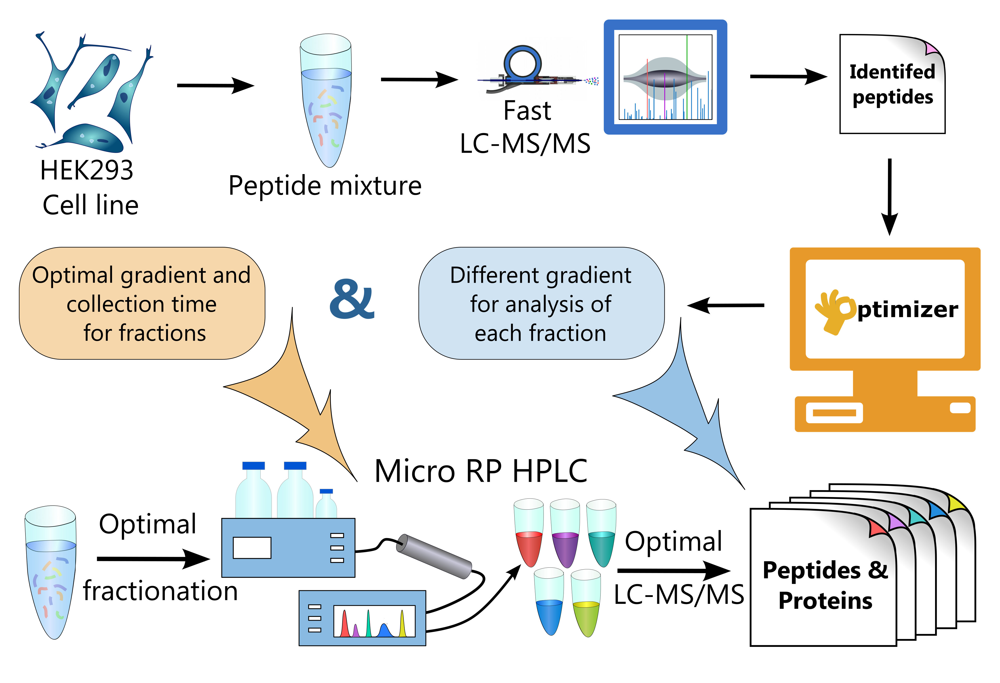

FractionOptimizer - calculate optimal LC conditions for fractionation and fraction analysis
===========================================================================================

Requirements
------------
- Python 2.7
- matplotlib
- scipy
- pyteomics
- pyteomics.biolccc

How to use
----------
    
``python FractionOptimizer.py parameters.cfg peptide_list.csv output_dir``

Peptide list
............

“peptide_list” is a list of identified peptides from the preliminary experiment.  
Only two columns called “sequence” and “RT exp” are required. However, it may contain any others. 
The peptide list should be in tab delimited format. 
Post-validation algorithm `MPscore <https://bitbucket.org/markmipt/mp-score>`_ generates the list in the required format.

Parameters
..........

The configuration file contains all parameters related to analysis, LC system and preliminary experiment,
such as the desired number of fractions, delay times, etc. 
his file should be in cfg format, the example can be found `here <https://bitbucket.org/levitsky/fractionoptimizer/src/tip/example_list_peptides.csv>`_. 
The approaches for measuring all these parameters are discussed in detail in supporting information. 

Output 
......

The program has two steps of optimization:

1.    In silico optimization of peptide distribution between the fractions. 

        There are 3 files related to this stage, the first one is called “optimal_fractions.txt” and contains start time and duration of the fraction collection, 
        as well as the predicted amount of peptides in each fraction. 
        The second one (“optimal_fractions.jpg”) is a graphical representation of the first file. 
        And the last one (“test_optimal_gradient.jpg”) is a predicted distribution of peptides in fractionation experiment. 
        Since the program calculates the optimal times for fraction collection in the standard gradient, it can be used for checking of this gradient. 
        If the distribution is not normal, the standard gradient should be modified (parameter “gradient used for fractionation analysis” in the configuration file).  
    
2.    Calculation of fraction-specific separation conditions in the subsequent LC-MS/MS analysis. 

        There are 3 files related to this stage, the first one is called “analytical_grad_for_fractions.txt” and contains the gradients for analysis of each fraction.
        In this file there are only percentages of phase B (default 100% ACN), the time points are the same for all fractions, 
        and they are contained in the configuration file (“time of the analytical gradient for each fraction”). 
        The second one (“analytical_grad_for_fractions.jpg”) is a graphical representation of the first file. 
        And the last one (“pep_distribution.jpg”) is a distribution of peptides from each fraction in the preliminary experiment.

Questions
---------
- `Create an issue <https://bitbucket.org/levitsky/fractionoptimizer/issues>`_ with BitBucket.
- Email us at pyteomics@googlegroups.com or biolccc@googlegroups.com.
